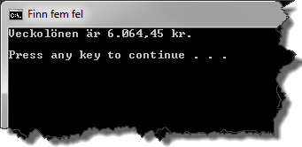

# Finn fem fel

## Problem

I koden har det smugit sig in fem fel. Du ska hitta och rätta alla fel så att programmet fungerar som det är tänkt.

Figur 1.

___Konsollfönster___

När du hittat felen och lyckats rätta dem ska du få en utskrift enligt nedan då du kör programmet.

Figur 2.

## Mål

Efter att ha gjort uppgiften ska du:

- Känna till hur du med hjälp av Visual Studio snabbt(?) och enkelt(?) hittar och rättar fel.
- Känna till hur ett flyttal presenteras som en valuta (currency) i en textsträng som skrivs ut i ett kommandofönster.

## Tips

Studera det första kapitlet i kurslitteraturen. Där hittar du information om reserverade ord, datatyper, strängar, hur satser avslutas och klammerparenteser.

[Lösning](losning/README.md)